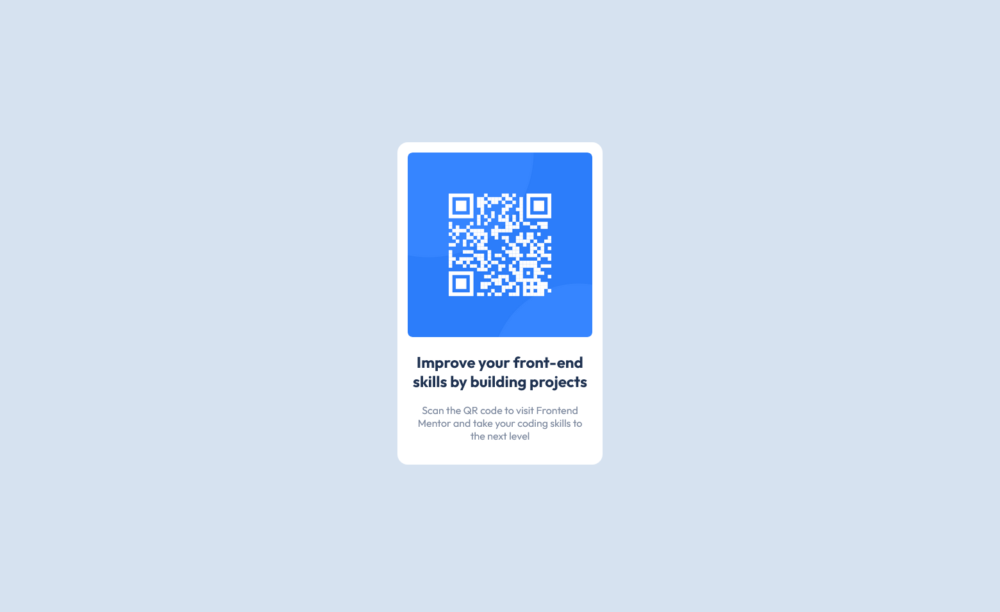

# Frontend Mentor - QR code component solution

This is a solution to the [QR code component challenge on Frontend Mentor](https://www.frontendmentor.io/challenges/qr-code-component-iux_sIO_H). Frontend Mentor challenges help you improve your coding skills by building realistic projects.

## Table of contents

- [Overview](#overview)
  - [Screenshot](#screenshot)
  - [Links](#links)
- [My process](#my-process)
  - [Built with](#built-with)
  - [What I learned](#what-i-learned)
  - [Continued development](#continued-development)
  - [Useful resources](#useful-resources)
- [Author](#author)

**Note: Delete this note and update the table of contents based on what sections you keep.**

## Overview

### Screenshot

### Links

- [Solution](https://github.com/beqarion/FEMentor_QRComponent)
- [Live Site](https://beqarion.github.io/FEMentor_QRComponent/)

## My process

### Built with

- Semantic HTML5 markup
- CSS custom properties
- CSS Grid
- Mobile-first workflow

### What I learned

Observing the example project screenshot, I realize that in card like element design, where there is a picture and text at the bottom, if text is slightly narrower than picture, it looks better.

### Continued development

Would like to know some css frameworks to add my toolbox.

### Useful resources

I am taking John Smilga course, which I like alot (

) So resets I used in css file, I learned from there. And lot of other things.

## Author

- Website - [Bekar Shekiladze](https://beqarion.github.io/my-resume.github.io/)
- Frontend Mentor - [@beqarion](https://www.frontendmentor.io/profile/beqarion)

